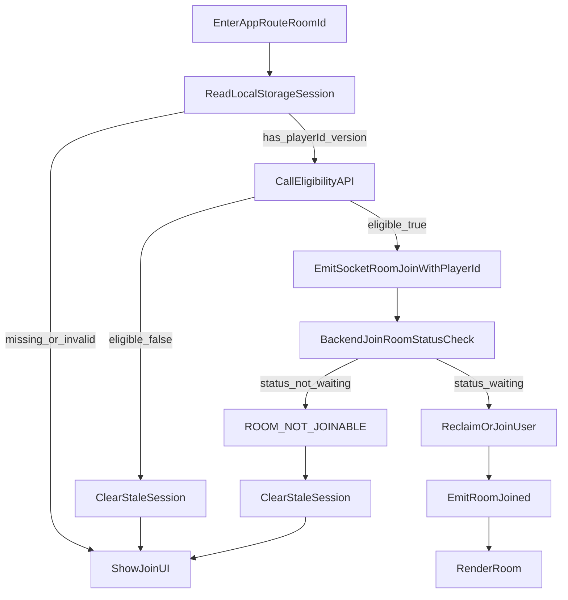

# Reconnection Logic

This document describes the room reconnection behavior currently implemented in the Bluff app.

## Goals

- Avoid duplicate player entries when the same user reconnects.
- Protect against stale local storage when room codes are reused.
- Allow auto-rejoin only in lobby (`waiting`) stage.
- Enforce strict behavior once game has started.

## Core Concepts

- `playerId`: stable identifier for a player slot in a room.
- `room.version`: server-generated room version (`UnixMilli`) set at room creation.
- Local session key: `bluff:session:<ROOM_CODE>` with `roomId`, `playerId`, `version`, `name`, `characterIndex`.

## Backend Rules

Primary file: `backend/socket.go`.

### 1) Room creation

- On `room:create`, server creates:
  - unique room code
  - `playerId` for creator
  - `room.version = time.Now().UnixMilli()`
- Response includes `room` and `playerId`.

### 2) Join and rejoin gating

- `joinRoom(...)` only allows join/rejoin when `room.status == waiting`.
- If room is not waiting, server returns `ROOM_NOT_JOINABLE`.
- Reclaim path uses `playerId` match only.

### 3) Eligibility API

- Endpoint: `GET /api/rooms/eligibility`
- Required query params:
  - `roomId`
  - `playerId`
  - `version`
- Eligible only when all are true:
  - room exists
  - player exists in that room
  - `room.version == version`

This prevents stale rejoin when the same room code appears again later with a new room instance.

### 4) Disconnect behavior

- In `waiting` stage:
  - mark player disconnected
  - keep in room for grace period (30s)
  - allow reclaim by matching `playerId` in time
- In non-waiting stages:
  - immediate hard removal on disconnect
  - no grace reconnect path

## Frontend Rules

Primary file: `frontend/src/Layouts/CreateNJoin/CreateNJoin.tsx`.

- On `/:roomId`, app checks local storage session for that room.
- If session has valid `playerId + version + name`, app calls eligibility API.
- While API is in progress, show loader.
- If eligible:
  - auto-emit `room:join` with stored `playerId`.
- If ineligible:
  - clear stale local storage session
  - show normal Join UI (name/avatar input).

## Sequence Diagram

## Notes

- `playerId` is the reconnect identity now; `reconnectToken` is no longer used.
- Room code uniqueness is enforced only among active rooms, so `room.version` is required to safely distinguish old vs new room instances sharing the same code over time.
