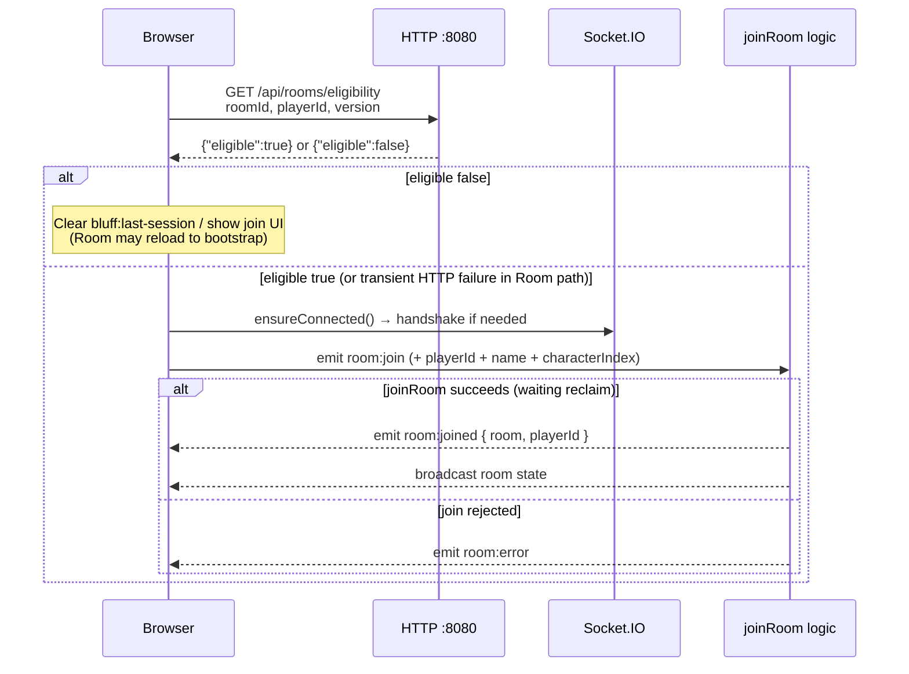
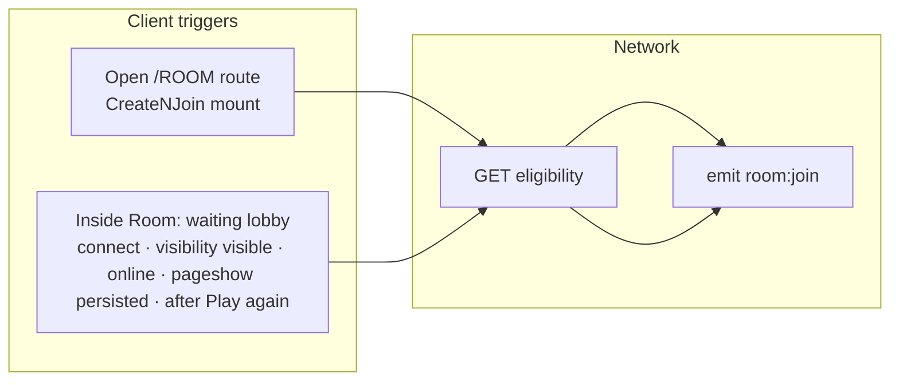

# Reconnection: client ↔ server network view

Application-level reconnect is **not** automatic from Socket.IO coming back alone. After transport recovery, the client must reclaim membership with **`room:join`** (carrying **`playerId`** for reclaim). Optionally, the client first asks the REST **`eligibility`** endpoint so stale `localStorage` (wrong **`version`** after room code reuse) does not blindly rejoin.

## Endpoints and events

| Layer | Direction | Name |
|-------|-----------|------|
| HTTP | Client → Server | `GET /api/rooms/eligibility?roomId=…&playerId=…&version=…` |
| HTTP | Server → Client | `200` body `{"eligible":true}` or `{"eligible":false}` |
| Socket.IO transport | Bidirectional | Engine.IO over `GET/POST …/socket.io/?EIO=4&transport=polling` → optional WebSocket upgrade |
| Socket.IO app | Client → Server | `emit('room:join', { roomId, name, characterIndex, playerId? })` |
| Socket.IO app | Server → Client | `emit('room:joined', { room, playerId })` |
| Socket.IO app | Server → Client | `emit('room:error', { code, message })` — e.g. `ROOM_NOT_JOINABLE` |
| Socket.IO app | Server → room | `emit('room:state', …)` (and related broadcasts after join) |

Same origin typically uses **`getApiBaseUrl()`** for both REST and `io(serverUrl, { path: '/socket.io/' })` ([`frontend/src/state/SocketProvider.tsx`](../frontend/src/state/SocketProvider.tsx)).

---

## Diagram 1 — Transport reconnect vs app reclaim

```mermaid
sequenceDiagram
  participant C as Browser client
  participant T as Socket.IO transport<br/>/socket.io/
  participant S as Go handlers<br/>room:join / room:joined

  Note over C,T: Tab background, network blip, or server restart:<br/>connection drops; Socket.IO may auto-reconnect.

  C->>T: Handshake / reconnect (polling or WebSocket)
  T-->>C: connected (possibly new socket id)

  Note over C,S: Room membership is not restored by transport alone.<br/>Client must emit room:join again (with playerId for reclaim).

  C->>S: emit room:join
  alt waiting + playerId reclaim OK
    S-->>C: emit room:joined
    S-->>C: emit room:state (broadcast to room)
  else game started or stale identity
    S-->>C: emit room:error (e.g. ROOM_NOT_JOINABLE)
  end
```

---

## Diagram 2 — Full reclaim sequence (REST + Socket.IO)

Typical ordering used from **`CreateNJoin`** (route `/`:roomId) and **`Room`** waiting-lobby recovery ([`docs/reconnection-logic.md`](./reconnection-logic.md), [`docs/waiting-lobby-foreground-recovery.md`](./waiting-lobby-foreground-recovery.md)).



---

## Diagram 3 — Where the client triggers reclaim

Two UI surfaces run the **same conceptual** HTTP → `room:join` pattern; **`Room`** must repeat it because returning from background does not remount **`CreateNJoin`**.



---

## Server-side disconnect (no extra client HTTP)

On socket disconnect the server updates in-memory membership ([`backend/socket.go`](../backend/socket.go)):

- **`waiting`**: player marked disconnected, **grace ~30s** (slot kept for reclaim by `playerId`).
- **game in progress**: **immediate removal**; reclaim via `room:join` is not available (`ROOM_NOT_JOINABLE`).

That behavior shapes whether a later **`room:join`** succeeds, but it is **not** a separate request the client sends on disconnect.

## Related

- [Reconnection logic](./reconnection-logic.md)
- [Waiting lobby foreground recovery](./waiting-lobby-foreground-recovery.md)
